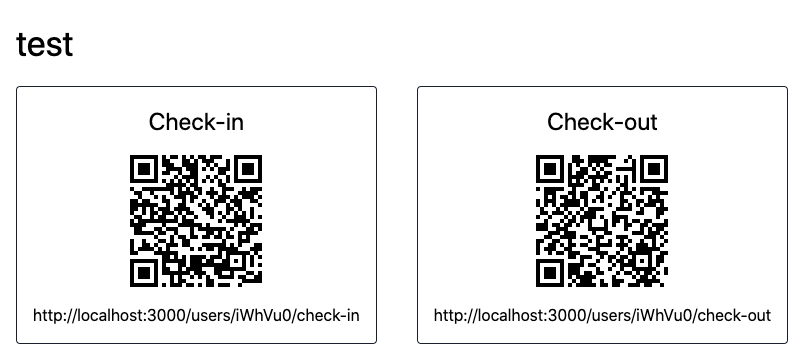

# QR Check-in

**STATUS: Experimental**

Service to check-in/out with a personal QR code.



## Requirements

[Yarn 1 (Classic)](https://classic.yarnpkg.com/lang/en/)

## Install

Create an `.env` file, based on `.env.example` and modify the default values.

```sh
yarn install
```

## Getting Started

Start the server and restart on changes automatically.

```sh
yarn start
```

## Production

I recommend [PM2](https://pm2.keymetrics.io/) to help you manage and keep your application online.

> Example

```sh
pm2 startup
pm2 start ./src/server.js --name qr-check-in
pm2 save
```

## Endpoints

```sh
/users/register?name=[your-name]
/users/:token/check-in
/users/:token/check-out
```
